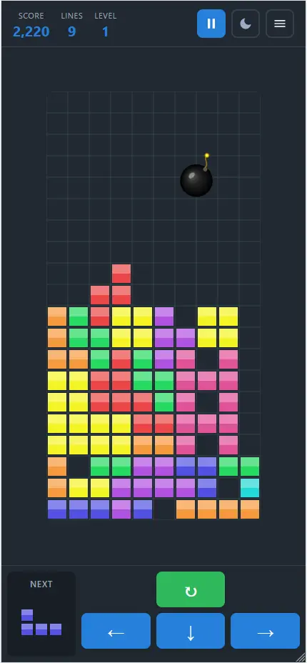
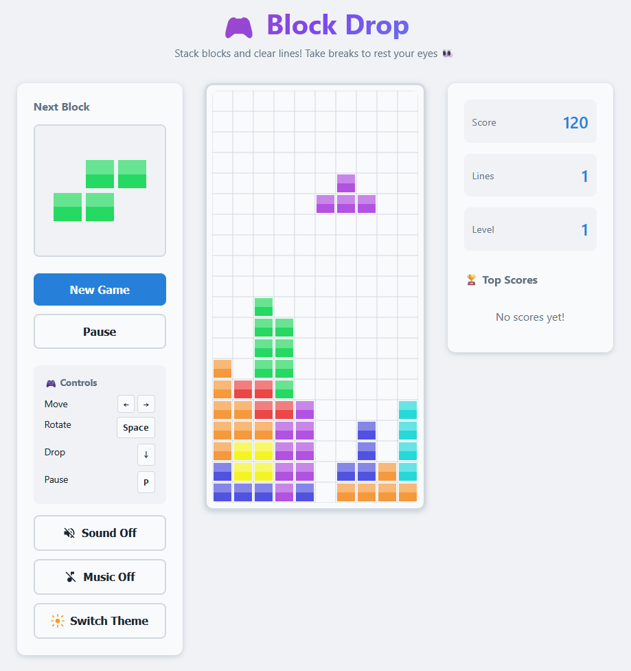
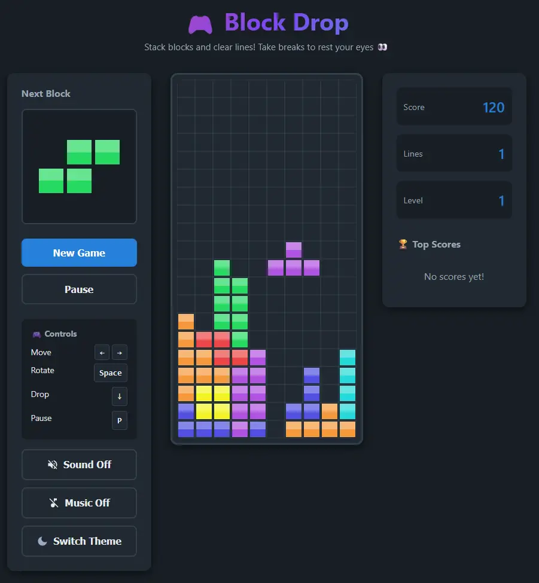
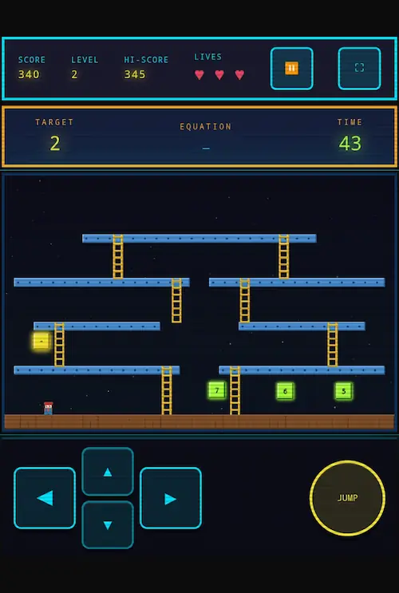
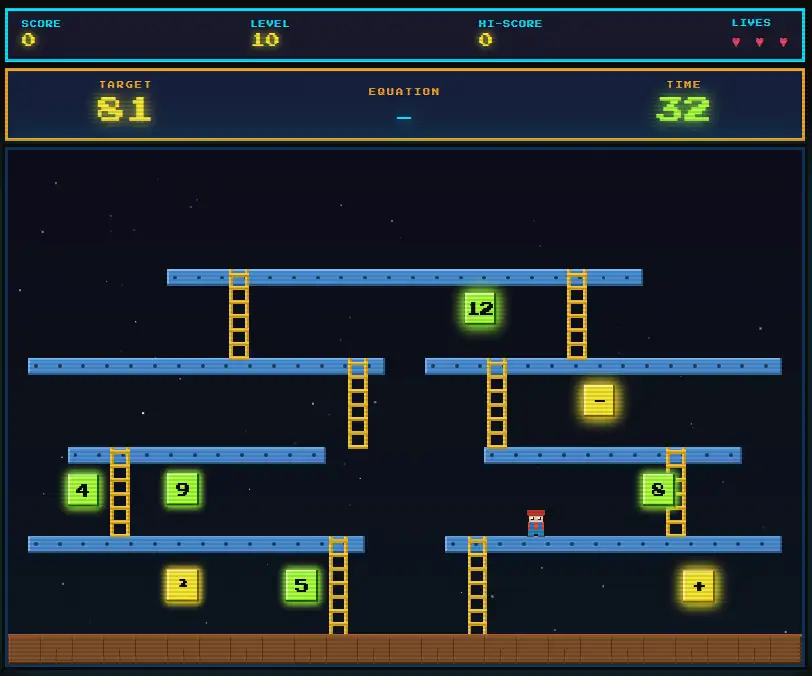

# Mini games

Quick fun little games.

Intentions:

- Kid-friendly - no ads, no dark patterns to keep kids hooked, no gamification/manipulation to buy stuff, etc.
- Each game is packaged in a single file where possible and dependency-free
- Not for redistribution/resale etc - just a fun way to explore some AI capabilities

## [🎮 Block Drop](https://anupshah.github.io/games/block-drop.html)

Like many Tetris-style games, but has some differences; slightly different piece set, and even a bomb to clear some space!

Every 10 minutes it will ask you to take a break. Not good for a kid to glue their eyes to a screen!

Mobile and desktop friendly.

[**Play Block Drop ⏩**](https://anupshah.github.io/games/block-drop.html)

  
Screenshots

  
  &nbsp;
  
  &nbsp;
  
  &nbsp;
  

## [🔢 Maths Quest](https://anupshah.github.io/games/maths-quest.html)

This was built to make number skills fun - while you're too busy jumping between platforms to notice you're doing maths! No ads, no subscriptions, no badges, no leaderboards pulling you back, no dark patterns - just a clean game that respects your time and attention.

It's a retro arcade platformer where you control a pixel-art character across a multi-floor Donkey Kong/Chucky-Egg -style stage, collecting numbers and mathematical operators to build an equation that hits a target number - before the clock runs out. As levels progress, the maths gets harder (multiplication, division, squares, square roots), the map fills with more distractors, and time pressure mounts. Inspired by a kid at high school who made something much better, in the 1990s for the BBC Micro!

Should work across devices, though might not be easiest on mobile phones. Tablet and desktop is easier.

[**Play Maths Quest ⏩**](https://anupshah.github.io/games/maths-quest.html)

  
Screenshots

  
  &nbsp;
  

---

### Technical stuff

This was mostly built using single non-descript prompts using just Claude Chat.

Some follow-up prompts were used to improve game play and provide some technical direction where it got stuck/muddled, for example:

- Refactor Block Drop to use a reactive state management approach (but dependency-free, so no React/Vue etc just a light-weight native implementation) where it struggled to keep track of all the different things to update.
- Help it where it was getting its CSS mixed up,

The intent here wasn't to make it code-perfect. Instead, I wanted to see what it could do so each game is standalone and dependency-free, while also providing some games for my kids, away from online distractions and dark patterns!

I am not experienced in creating games or using `canvas`, so I mostly let it do what it needed in terms of rendering.

---
<small>Emoji graphic for favicon and app icon by [Twemoji](https://github.com/jdecked/twemoji), licensed under [CC BY 4.0](https://creativecommons.org/licenses/by/4.0/)</small>